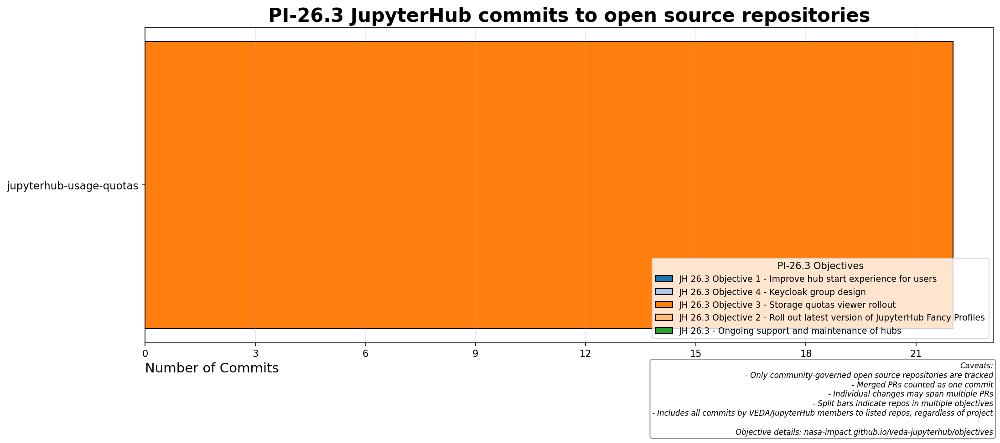

# Quarterly Objectives

This page tracks quarterly objectives for the VEDA/JupyterHub team and the open-source repositories they touch across Program Increments (PIs).

## Current PI: 26.3



| # | Objective | Contributors | Repos |
|---|-----------|--------------|-------|
| [#110](https://github.com/NASA-IMPACT/veda-jupyterhub/issues/110) | JH 26.3 Objective 1 - Improve hub start experience for users | yuvipanda, sunu | - |
| [#111](https://github.com/NASA-IMPACT/veda-jupyterhub/issues/111) | JH 26.3 Objective 4 - Keycloak group design | yuvipanda, sunu | - |
| [#112](https://github.com/NASA-IMPACT/veda-jupyterhub/issues/112) | JH 26.3 Objective 3 - Storage quotas viewer rollout | sunu, jnywong | jupyterhub-usage-quotas |
| [#113](https://github.com/NASA-IMPACT/veda-jupyterhub/issues/113) | JH 26.3 Objective 2 - Roll out latest version of JupyterH... | batpad, sunu | jupyterhub-fancy-profiles, kubespawner |
| [#115](https://github.com/NASA-IMPACT/veda-jupyterhub/issues/115) | JH 26.3 - Ongoing support and maintenance of hubs | yuvipanda | - |

---

## Configuration

Objectives data lives in [`reports/_objectives_data.py`](https://github.com/NASA-IMPACT/veda-jupyterhub/blob/main/reports/_objectives_data.py) — auto-generated from GitHub issues by `dse_oss_reports.generator.ObjectivesGenerator`.

To regenerate this page:

```bash
cd reports
uv run generate_docs.py
```
